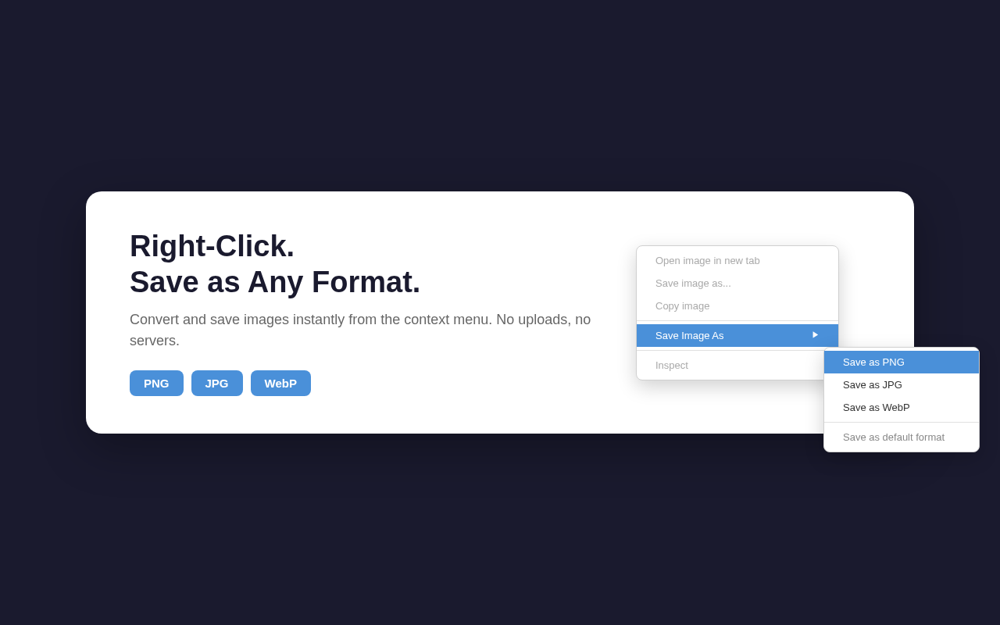
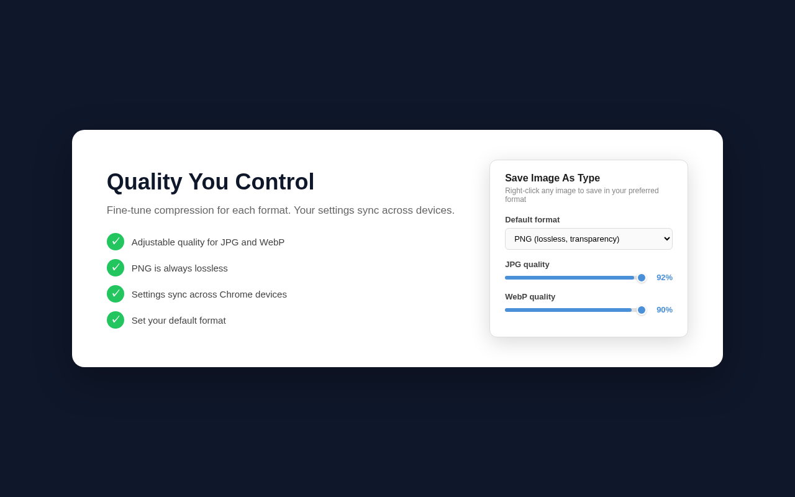

# Save Image As PNG, JPG, WebP — Image Converter

Chrome extension to save any image from the web as PNG, JPG, or WebP. Fast client-side conversion via Canvas API — no uploads, no servers, 100% private.

> AVIF was removed in v1.2.0: Chrome's `canvas.toBlob()` cannot encode `image/avif`, so the option could never work client-side.

## Install

### Chrome Web Store

**[Install from the Chrome Web Store](https://chromewebstore.google.com/detail/save-image-as-type-png-jp/bbahljpklphbjnapiehkkijjofgceenm)**

**Edge Add-ons / Opera Add-ons** — not published there yet. The extension is Manifest V3
and the same ZIP works in both browsers, so until then use the manual install below.

### Manual install (any Chromium browser)

1. Download the latest `save-image-as-type-<version>.zip` from
   [Releases](https://github.com/stufently/save-image-as-type/releases), or clone this repo
2. Unzip it
3. Open `chrome://extensions/`
4. Enable **Developer mode** (top right)
5. Click **Load unpacked**
6. Select the unzipped folder — or, if you cloned the repo, the `extension/` folder

Manually installed extensions do not auto-update; repeat the steps to upgrade.

## Features

- Right-click context menu on any image: Save as PNG, JPG, WebP — plus a
  **Save as default format** item that skips the format submenu
- Client-side conversion via Canvas API (no server, no uploads)
- Quality sliders for lossy formats (JPG, WebP); PNG is always lossless
- Smart transparency handling (white background for JPG)
- Works on SVG, `data:` URLs, `blob:` URLs, cross-origin and cookie-protected images
- Keeps the original filename and swaps only the extension
- Always opens the "Save As" dialog, so you choose the destination
- Refuses to silently save the wrong format: if the encoder falls back, you get an error
- 100-megapixel guard against memory-exhausting images
- Welcome page on first install
- Manifest V3, minimal permissions
- Open source

## Interface

The extension adds one submenu to the image right-click menu — there is no other UI to learn:



Clicking the toolbar icon opens a small settings popup: a **Default format** dropdown
(used by the "Save as default format" menu item) and **JPG quality** / **WebP quality**
sliders. PNG has no slider because it is lossless.



## How to Use

1. Right-click any image on a webpage
2. Select **Save Image As** from the context menu
3. Choose your format: PNG, JPG, or WebP
4. Pick where to save — done!

**Tip:** Click the extension icon to adjust default format and quality settings.

## Supported Formats

| Format | Type | Best For |
|---|---|---|
| PNG | Lossless | Screenshots, graphics, transparency |
| JPG | Lossy (adjustable) | Photos, smaller file size |
| WebP | Lossy (adjustable) | Modern web, 25-35% smaller than JPG |

## Why This Extension

Image-format converters are a crowded category, and most of them either upload your image
to a server or have gone unmaintained. This one is deliberately narrow:

- **Conversion never leaves the machine.** The image is decoded and re-encoded with the
  browser's own Canvas API. There is no backend, no upload endpoint, no analytics, and no
  account. See [Privacy](#privacy).
- **Manifest V3.** Works under Chrome's current extension platform rather than the retired
  MV2 one.
- **Only formats that actually work.** AVIF was removed in v1.2.0 once it was confirmed
  that `canvas.toBlob()` cannot encode `image/avif` — shipping the option would mean a
  menu item that always fails.
- **Handles the awkward sources**, not just plain `` tags: SVG (including
  `width="100%"` and viewBox-only files), `data:` URLs, `blob:` URLs, cross-origin images,
  and cookie-protected images behind a login.
- **Open source, MIT.** Every line that touches your images is in this repo, and releases
  are built by CI from a tag rather than uploaded by hand.
- **Localized** into 7 languages — extension name, store description, and the context menu
  items you actually click. (The settings popup and error messages are still English-only.)

## Architecture

```
extension/
├── manifest.json          # Manifest V3 config
├── background.js          # Service worker: context menus, fetch, download orchestration
├── offscreen.html/.js     # Offscreen document for Canvas API image conversion
├── welcome.html           # Onboarding page shown on first install
├── popup/                 # Settings popup (format, quality sliders)
├── icons/                 # Extension icons (16/32/48/128)
└── _locales/              # Localization (en, es, pt_BR, de, fr, ja, ru)
```

**Why offscreen document?** Service workers cannot use DOM Canvas with `toBlob()` for all formats. The offscreen document provides a real DOM context for image conversion.

**Flow:** Right-click image → background.js fetches image blob → sends to offscreen.js for Canvas conversion → downloads converted blob via `chrome.downloads`.

## Permissions

| Permission | Why |
|---|---|
| `contextMenus` | Right-click menu items |
| `downloads` | Save converted images |
| `storage` | Remember quality settings |
| `notifications` | Show conversion error messages |
| `offscreen` | Create offscreen document for Canvas API conversion |
| `scripting` | Read blob: image URLs from the page that created them |
| `<all_urls>` (host) | Fetch images from any domain (required for cross-origin image download) |

Note: `<all_urls>` host permission is broad but necessary — the extension has to fetch the
image you right-clicked, and that image can live on any domain. `scripting` is used on one
narrow path only: reading a `blob:` image URL from the page that created it. Every declared
permission is actually used; none is reserved "for later".

## Release & Publishing

### Creating a Release

1. Update version in `extension/manifest.json`
2. Commit the change
3. Create and push a git tag:

```bash
git tag v1.0.1
git push && git push --tags
```

GitHub Actions will automatically build a ZIP, create a GitHub Release, and upload and publish
the new version to the Chrome Web Store. The CWS credentials are already configured in this
repository — the pipeline has been shipping releases this way since v1.2.0.

### Chrome Web Store auto-publish

The `publish-chrome` job in `.github/workflows/release.yml` runs when the repository variable `CWS_EXTENSION_ID` is set. Required configuration (Settings → Secrets and variables → Actions):

| Kind | Name | Value |
|---|---|---|
| Variable | `CWS_EXTENSION_ID` | Extension ID from the CWS dashboard URL |
| Secret | `CWS_CLIENT_ID` | OAuth client ID (Google Cloud Console) |
| Secret | `CWS_CLIENT_SECRET` | OAuth client secret |
| Secret | `CWS_REFRESH_TOKEN` | OAuth refresh token with `chromewebstore` scope |

See [Chrome Web Store API docs](https://developer.chrome.com/docs/webstore/using-api) for obtaining the OAuth credentials. The first submission must still go through the CWS dashboard UI; auto-publish handles updates.

### Publishing to Other Stores

Download the ZIP from GitHub Releases and upload manually:

| Store | Dashboard | Cost |
|---|---|---|
| Chrome Web Store | [CWS Developer Dashboard](https://chrome.google.com/webstore/devconsole) | $5 one-time |
| Edge Add-ons | [Partner Center](https://partner.microsoft.com/dashboard/microsoftedge/overview) | Free |
| Opera Add-ons | [Opera Developer](https://addons.opera.com/developer/) | Free |

The same ZIP works for all three stores (Manifest V3 compatible).

### Versioning

- Version lives in `extension/manifest.json` (`"version"` field)
- Git tags must match: tag `v1.0.1` requires manifest version `1.0.1`
- CI verifies the match and fails if they differ

## Localization

Extension name, store description, and context-menu items are localized in
`extension/_locales/`. The settings popup, the welcome page, and error notifications are
currently hardcoded English.

| Language | Code |
|---|---|
| English | `en` |
| Spanish | `es` |
| Portuguese (Brazil) | `pt_BR` |
| German | `de` |
| French | `fr` |
| Japanese | `ja` |
| Russian | `ru` |

## Privacy

**Your images are never uploaded.** Conversion runs on the browser's own Canvas API inside an
offscreen document: the image is decoded, drawn to a canvas, re-encoded with `toBlob()`, and
handed to `chrome.downloads`. There is no backend, no upload endpoint, no analytics, no
tracking, no account, and no remote code — the extension loads no external scripts, styles,
or fonts.

Two details stated plainly, because "collects nothing" deserves the fine print:

- **Fetching the image contacts its own host.** To convert an image the extension downloads
  it first, exactly like the browser did when it displayed it. If that request fails or
  comes back as non-image content (a login page), it retries once with credentials, so
  cookies you already have for *that host* are sent to *that host*. Nothing goes anywhere
  else.
- **Settings use `chrome.storage.sync`.** Your default format and the two quality numbers
  ride Chrome's own sync to your other signed-in Chrome devices. That is three values —
  `defaultFormat`, `jpgQuality`, `webpQuality` — and nothing about which images you saved,
  which sites you visited, or who you are.

See [PRIVACY.md](PRIVACY.md) for the full policy.

## License

MIT
